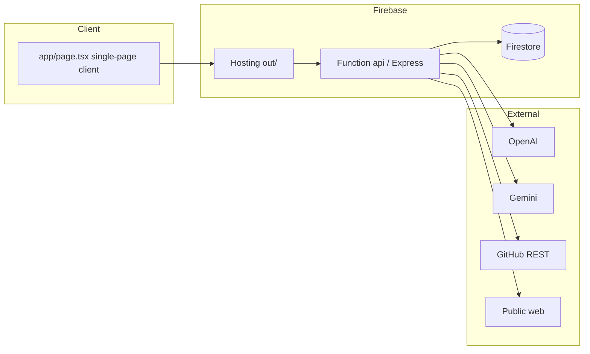

# ARCHITECTURE_REPORT.md

## Overview

A static Next.js frontend (`output: "export"`) talks to a single Express app deployed as one Firebase Cloud Function (`api`). Firebase Hosting serves the static export and rewrites `/api/**` to the function (`firebase.json:13-19`). All persistence is Firestore via the Admin SDK; direct client access is denied (`firestore.rules`).

## Layering (backend)

- **Composition root:** `functions/src/index.ts` — env load, CORS, body limit, prefix strip, router mounting, single export.
- **Cross-cutting:** `auth.ts` (auth), `ratelimit.ts` (in-memory limiter), `util.ts` (`serverTime`, `logEvent`), `firebase.ts` (Admin init).
- **Domain services:** `ai.ts` (provider/key resolution), `memory.ts` (vector search), `github.ts` (ingest), `ssrf.ts` (safe URL fetch), `crypto.ts` (key encryption), `pure.ts` (pure helpers).
- **Providers:** `providers/openai.ts`, `providers/gemini.ts` behind a frozen contract `providers/types.ts`.
- **Routes:** one router per feature under `routes/`, each: zod-parse → ownership check → service call → `logEvent` → JSON.

This is a clean, conventional **layered modular monolith**. Separation of pure logic (`pure.ts`) from IO makes the core unit-testable (`test/pure.test.ts`).

## Strengths

1. **Strong tenant isolation.** Every query filters `where("userId","==",...)` (e.g. `memory.ts:26`, `routes/projects.ts:20`) and mutating routes re-check ownership (`projects.ts:12-16`, `design.ts:41`, `plans.ts:32`). Firestore rules deny all client access as defense-in-depth.
2. **Provider abstraction is frozen and documented** (`providers/types.ts`) with type-level tests locking the security contract (`test/keys.test.ts:86-123`).
3. **Secret handling.** AES-256-GCM with per-call IV + auth tag; raw keys never returned; only `last4` exposed (`crypto.ts`, `keys.ts:24-35`).
4. **SSRF protection** for the "learn URL" feature with IPv4/IPv6 private-range checks and DNS resolution checks (`ssrf.ts:5-61`), covered by tests (`test/ssrf.test.ts`).
5. **Read-only GitHub guarantee** — only `GET` calls (`github.ts:20-27`).

## Weaknesses / risks

1. **In-memory vector search** (`memory.ts:24-45`) loads up to 1500 docs per query and computes cosine in the function — O(N·d) per request, unbounded Firestore read cost, recall silently capped. Not a vector DB. **Primary scaling bottleneck.**
2. **Long synchronous jobs in request scope.** `connect-github` ingests up to 200 files with sequential embedding batches inside the HTTP request (`github.ts:84-111`); large repos risk function timeout and partial state (`ingestStatus:"error"`).
3. **Session model is thin.** Tokens never expire and are matched by Firestore query (`auth.ts:67`); no rotation, no server-side logout, no index guarantee.
4. **Single function = single failure/scaling unit.** All endpoints share one function's concurrency, memory, and cold-start profile.
5. **Plaintext GitHub token** breaks the otherwise-encrypted secret model (`projects.ts:79`).
6. **`ensureSeedUsers()` on every login** (`public.ts:17`) does N Firestore reads per login attempt.

## Data model notes

Collections are flat and `userId`-stamped rather than nested under `users/{id}` (e.g. `topics`, `knowledge_chunks`). This keeps queries simple but relies entirely on application-layer scoping (acceptable because client access is denied). No schema/migration tooling; documents are loosely typed (`db.settings({ignoreUndefinedProperties:true})`, `firebase.ts:6`).

## Architecture score: 78/100

Clean separation, strong isolation, and good security primitives, held back by the in-memory RAG design, in-request long jobs, and a thin session model.
