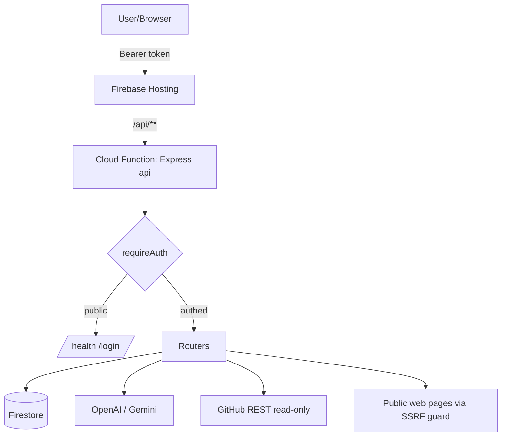

# PROJECT_AUDIT.md — GHOST Agent Builder

> Full-repository intelligence audit. Every conclusion is backed by source references in `path:line` form.
> Read-only analysis (Phases 1–12, 14). Phase 13 writes/updates the report files only.

---

## 1. Project Purpose

**GHOST Agent Builder** is a multi-tenant web app that turns scattered learning material and a GitHub repository into **actionable, downloadable build artifacts** (markdown design docs + ready-to-paste AI-executor prompts) for a software project.

The workflow encoded in the UI (`app/i18n.ts` `STEP_KEYS`, `app/page.tsx:570-580`) is:

1. **Overview** — dashboard of counts + recent activity (`functions/src/routes/dashboard.ts`).
2. **Sources** — create *Topics*, then *learn* public URLs into a vector memory (`functions/src/routes/topics.ts`, `functions/src/routes/sources.ts`).
3. **Skills** — extract reusable engineering "skills" from a topic's learned material via the LLM (`functions/src/routes/skills.ts:50-99`).
4. **Projects** — register a project, optionally **read-only ingest** a GitHub repo into memory (`functions/src/routes/projects.ts`, `functions/src/github.ts`).
5. **Ask** — RAG Q&A across the user's memory (`functions/src/routes/ask.ts`).
6. **Design** — generate a design decision for a project/section (`functions/src/routes/design.ts`).
7. **Plan** — generate md files + executor prompts (`functions/src/routes/plans.ts`).
8. **Settings** — bring-your-own AI key management (`functions/src/routes/keys.ts`).

**Users:** small, seeded set of authenticated builders/engineers (seed users from `SEED_USERS` env, `functions/src/auth.ts:28-41`). The UI is bilingual EN/HE with RTL support and dark/light themes (`app/page.tsx:100-101,170`).

**Business value:** compresses "research → understand existing code → design change → produce executable plan/prompts" into one guided pipeline, with each user's data fully isolated. It never writes to the user's GitHub (read-only ingestion, `functions/src/github.ts:20`).

---

## 2. Technology Stack

| Layer | Technology | Evidence |
|---|---|---|
| Frontend | Next.js (App Router, `output: "export"` static) + React, single-file client | `next.config.ts:4`, `app/page.tsx:1` |
| Styling/i18n | Hand-rolled CSS + custom dictionary (EN/HE) | `app/styles.css`, `app/i18n.ts` |
| Backend | Firebase Cloud Functions (Gen, Node 22) + Express 4 | `functions/src/index.ts:72`, `functions/package.json:13-14` |
| Data | Cloud Firestore (Admin SDK) | `functions/src/firebase.ts` |
| AI | OpenAI (`openai@4`) + Google Gemini (`@google/generative-ai@0.21`) | `functions/src/providers/*` |
| Validation | Zod | `functions/src/schemas.ts` |
| Web scraping | cheerio + fetch | `functions/src/ssrf.ts` |
| Crypto | Node `crypto` (AES-256-GCM, scrypt) | `functions/src/crypto.ts`, `functions/src/auth.ts` |
| Hosting | Firebase Hosting (static `out/`) + `/api/**` rewrite to function | `firebase.json:13-19` |
| Tests | Vitest (unit only) | `functions/vitest.config.ts`, `functions/test/*` |
| CI | GitHub Actions (typecheck, build, test, secret-scan) | `.github/workflows/ci.yml` |

**Third-party integrations:** OpenAI API, Gemini API, GitHub REST API v3 (`functions/src/github.ts:6`).

---

## 3. Architecture Map

### Request flow
```
Browser (static Next.js export)
   │  fetch(`${NEXT_PUBLIC_API_BASE|/api}${path}`)  app/page.tsx:8,20-34
   ▼
Firebase Hosting  ──rewrite /api/** ──►  Cloud Function `api`   firebase.json:17
   ▼
Express app (functions/src/index.ts)
   ├─ cors() + json(4mb)                      index.ts:42-48
   ├─ strip `/api` prefix                     index.ts:51-55
   ├─ publicRouter  (/health, /login)         index.ts:58  (NO auth)
   ├─ requireAuth   (Bearer → users.sessionToken lookup)  auth.ts:59-79
   └─ feature routers: topics, sources, skills, projects,
        ask, design, plans, dashboard, keys   index.ts:62-70
   ▼
Firestore (Admin SDK, per-user scoped queries)  +  AI providers
```

### Authentication flow
- `POST /login` (`routes/public.ts:14-31`): seeds users on demand, verifies scrypt hash with `timingSafeEqual` (`auth.ts:19-24`), issues a random 24-byte hex `sessionToken` stored on the user doc.
- Client persists `{username, token}` in `localStorage` (`app/page.tsx:182`) and sends `Authorization: Bearer <token>`.
- `requireAuth` looks the token up via `users.where("sessionToken","==",token)` (`auth.ts:67`). **No expiry / rotation** (see SECURITY_REPORT.md).

### Data flow (RAG)
```
learn URL → readUrl() SSRF-guarded fetch → chunkText → embedding() per chunk
          → knowledge_chunks{userId, scope, embedding, ...}     sources.ts:54-77
ask/design/plan → embedding(query) → load ≤1500 user chunks → cosine in memory
          → top-k context → llm()/generateAnswer()             memory.ts:24-45
```

### Firestore collections
`users`, `topics`, `sources`, `knowledge_chunks`, `agent_skills`, `projects`, `project_decisions`, `generated_plans`, `agent_logs` (`routes/dashboard.ts:8-17`). All client access denied; only the Admin SDK in functions touches data (`firestore.rules:7-8`).



---

## Architecture, Quality, Security, Scalability & Maintainability scores

See `ARCHITECTURE_REPORT.md`, `SECURITY_REPORT.md`, `PERFORMANCE_REPORT.md`, `TECH_DEBT.md`, and the Executive Report (chat output / bottom of this set) for full scoring and evidence.

**Headline scores (0–100):**

| Dimension | Score |
|---|---|
| Architecture | 78 |
| Code Quality | 80 |
| Security | 62 |
| Scalability | 55 |
| Maintainability | 80 |
| **Overall Project Score** | **70** |

The project is a clean, well-factored MVP with strong per-user isolation, real encryption for provider keys, and a thoughtful SSRF guard. The principal risks are **scalability of in-memory vector search**, **plaintext GitHub token storage**, **non-expiring session tokens**, and **unthrottled `/login`**.
