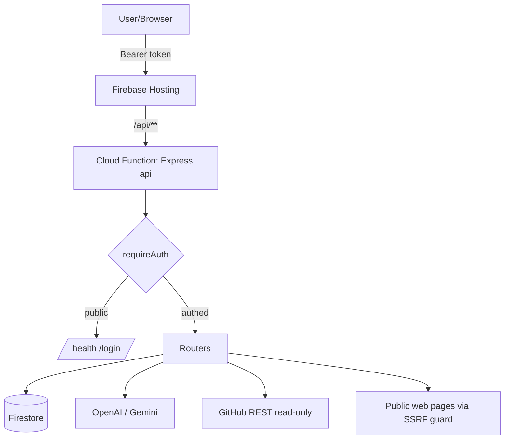

# PROJECT_AUDIT.md — GHOST Agent Builder

> Full-repository intelligence audit. Every conclusion is backed by source references in `path:line` form.
> Read-only analysis (Phases 1–12, 14). Phase 13 writes/updates the report files only.

---

## 1. Project Purpose

**GHOST Agent Builder** is a multi-tenant web app that turns scattered learning material and a GitHub repository into **actionable, downloadable build artifacts** (markdown design docs + ready-to-paste AI-executor prompts) for a software project.

The workflow encoded in the UI (`app/i18n.ts` `STEP_KEYS`, `app/page.tsx:570-580`) is:

1. **Overview** — dashboard of counts + recent activity (`functions/src/routes/dashboard.ts`).
2. **Sources** — create *Topics*, then *learn* public URLs into a vector memory (`functions/src/routes/topics.ts`, `functions/src/routes/sources.ts`).
3. **Skills** — extract reusable engineering "skills" from a topic's learned material via the LLM (`functions/src/routes/skills.ts:50-99`).
4. **Projects** — register a project, optionally **read-only ingest** a GitHub repo into memory (`functions/src/routes/projects.ts`, `functions/src/github.ts`).
5. **Ask** — RAG Q&A across the user's memory (`functions/src/routes/ask.ts`).
6. **Design** — generate a design decision for a project/section (`functions/src/routes/design.ts`).
7. **Plan** — generate md files + executor prompts (`functions/src/routes/plans.ts`).
8. **Settings** — bring-your-own AI key management (`functions/src/routes/keys.ts`).

**Users:** small, seeded set of authenticated builders/engineers (seed users from `SEED_USERS` env, `functions/src/auth.ts:28-41`). The UI is bilingual EN/HE with RTL support and dark/light themes (`app/page.tsx:100-101,170`).

**Business value:** compresses "research → understand existing code → design change → produce executable plan/prompts" into one guided pipeline, with each user's data fully isolated. It never writes to the user's GitHub (read-only ingestion, `functions/src/github.ts:20`).

---

## 2. Technology Stack

| Layer | Technology | Evidence |
|---|---|---|
| Frontend | Next.js (App Router, `output: "export"` static) + React, single-file client | `next.config.ts:4`, `app/page.tsx:1` |
| Styling/i18n | Hand-rolled CSS + custom dictionary (EN/HE) | `app/styles.css`, `app/i18n.ts` |
| Backend | Firebase Cloud Functions (Gen, Node 22) + Express 4 | `functions/src/index.ts:72`, `functions/package.json:13-14` |
| Data | Cloud Firestore (Admin SDK) | `functions/src/firebase.ts` |
| AI | OpenAI (`openai@4`) + Google Gemini (`@google/generative-ai@0.21`) | `functions/src/providers/*` |
| Validation | Zod | `functions/src/schemas.ts` |
| Web scraping | cheerio + fetch | `functions/src/ssrf.ts` |
| Crypto | Node `crypto` (AES-256-GCM, scrypt) | `functions/src/crypto.ts`, `functions/src/auth.ts` |
| Hosting | Firebase Hosting (static `out/`) + `/api/**` rewrite to function | `firebase.json:13-19` |
| Tests | Vitest (unit only) | `functions/vitest.config.ts`, `functions/test/*` |
| CI | GitHub Actions (typecheck, build, test, secret-scan) | `.github/workflows/ci.yml` |

**Third-party integrations:** OpenAI API, Gemini API, GitHub REST API v3 (`functions/src/github.ts:6`).

---

## 3. Architecture Map

### Request flow
```
Browser (static Next.js export)
   │  fetch(`${NEXT_PUBLIC_API_BASE|/api}${path}`)  app/page.tsx:8,20-34
   ▼
Firebase Hosting  ──rewrite /api/** ──►  Cloud Function `api`   firebase.json:17
   ▼
Express app (functions/src/index.ts)
   ├─ cors() + json(4mb)                      index.ts:42-48
   ├─ strip `/api` prefix                     index.ts:51-55
   ├─ publicRouter  (/health, /login)         index.ts:58  (NO auth)
   ├─ requireAuth   (Bearer → users.sessionToken lookup)  auth.ts:59-79
   └─ feature routers: topics, sources, skills, projects,
        ask, design, plans, dashboard, keys   index.ts:62-70
   ▼
Firestore (Admin SDK, per-user scoped queries)  +  AI providers
```

### Authentication flow
- `POST /login` (`routes/public.ts:14-31`): seeds users on demand, verifies scrypt hash with `timingSafeEqual` (`auth.ts:19-24`), issues a random 24-byte hex `sessionToken` stored on the user doc.
- Client persists `{username, token}` in `localStorage` (`app/page.tsx:182`) and sends `Authorization: Bearer <token>`.
- `requireAuth` looks the token up via `users.where("sessionToken","==",token)` (`auth.ts:67`). **No expiry / rotation** (see SECURITY_REPORT.md).

### Data flow (RAG)
```
learn URL → readUrl() SSRF-guarded fetch → chunkText → embedding() per chunk
          → knowledge_chunks{userId, scope, embedding, ...}     sources.ts:54-77
ask/design/plan → embedding(query) → load ≤1500 user chunks → cosine in memory
          → top-k context → llm()/generateAnswer()             memory.ts:24-45
```

### Firestore collections
`users`, `topics`, `sources`, `knowledge_chunks`, `agent_skills`, `projects`, `project_decisions`, `generated_plans`, `agent_logs` (`routes/dashboard.ts:8-17`). All client access denied; only the Admin SDK in functions touches data (`firestore.rules:7-8`).



---

## Architecture, Quality, Security, Scalability & Maintainability scores

See `ARCHITECTURE_REPORT.md`, `SECURITY_REPORT.md`, `PERFORMANCE_REPORT.md`, `TECH_DEBT.md`, and the Executive Report (chat output / bottom of this set) for full scoring and evidence.

**Headline scores (0–100) — pre-orchestration baseline (original audit):**

| Dimension | Score |
|---|---|
| Architecture | 78 |
| Code Quality | 80 |
| Security | 62 |
| Scalability | 55 |
| Maintainability | 80 |
| **Overall Project Score** | **70** |

The project is a clean, well-factored MVP with strong per-user isolation, real encryption for provider keys, and a thoughtful SSRF guard. The principal risks are **scalability of in-memory vector search**, **plaintext GitHub token storage**, **non-expiring session tokens**, and **unthrottled `/login`**.

> **Scores revised 2026-06-22** after the 4-wave hardening orchestration — see
> [§ 2026-06-22 — 4-Wave Hardening Orchestration](#2026-06-22--4-wave-hardening-orchestration)
> below for the updated table and justification.

---

## 2026-06-22 — 4-Wave Hardening Orchestration

A 16-workstream, 4-wave parallel orchestration (each workstream is an isolated git
worktree on a committed feature branch, ready for merge) delivered the security,
scalability, observability, and engineering-discipline work prioritized by the
original audit. This section summarizes what shipped and revises the headline
scores. All commit SHAs below are verified against the feature branches; the
authoritative merge runbook is [`docs/notes/integration-plan.md`](./docs/notes/integration-plan.md).

### What each workstream delivered

**Wave 1 — foundational security & gates**

| ID | Branch (commit) | Summary |
|---|---|---|
| A | `feature/vector-backend` (`b91c0aa`) | Firestore Vector Search (`findNearest`) is the **default** backend with emulator auto-fallback + per-request graceful fallback to in-memory cosine on `findNearest` error; real COSINE scores. (`memory.ts`, `pure.ts`, ADR-0001, `docs/notes/vector-migration.md`) |
| B | `feature/ssrf-hardening` (`f89ac63`) | Closed redirect-follow SSRF (manual redirects + per-hop revalidation, 5-hop cap) and DNS-rebinding TOCTOU (verified-IP pinning via undici dispatcher preserving Host/SNI). (`ssrf.ts`) |
| C | `feature/app-check` (`d073f97`) | Removed reflect-all dev CORS → explicit localhost allow-list; added staged Firebase App Check (off/warn/enforce, default warn, emulator-bypass) on the authed section. (`index.ts`, `auth.ts`) |
| D | `feature/eslint-gate` (`b430f44`) | Root `eslint.config.mjs` (flat, eslint-config-next 16) + CI lint is now a **mandatory hard-fail gate**. (`eslint.config.mjs`, `ci.yml`, `package.json`) |

**Wave 2 — scalability & coverage (build on Wave 1)**

| ID | Branch (commit) | Summary |
|---|---|---|
| E | `feature/embedding-dimension` (`94a767a`, ←A) | ADR-0008 + `normalizeEmbedding()` to a canonical `TARGET_EMBED_DIM` (default 1536; avg-pool/zero-pad + L2-renorm) so 768 (Gemini) / 1536 (OpenAI) all fit one vector index. (`ai.ts`, `learn.ts`, `firestore.indexes.json`) |
| F | `feature/runtime-optimization` (`c7abbeb`, ←C) | `api` function 2GiB/concurrency-8 → 1GiB/concurrency-60 (env-overridable) + cold-start guard; **~14× lower memory-billed cost**. (`index.ts`, `docs/notes/runtime-load-test.md`) |
| G | `feature/pagination` (`190a811`) | Keyset cursor pagination — new `listScopedPage()` → `{items, nextCursor}`, opaque base64url cursor, id tie-break; threaded into `/topics` & `/sources` additively; `listScoped()` unchanged. (`listing.ts`, `routes/topics.ts`, `routes/sources.ts`) |
| H | `feature/coverage-improvement` (`0a335a8`, ←D) | Added unit suites lifting `providers/**`, `github.ts`, `concurrency.ts` to ~100%; removed those coverage excludes; raised CI gate to **85/85/85** lines/stmts/funcs + 75 branches. (`ci.yml`, new tests) |

**Wave 3 — observability & validation (build on Wave 1)**

| ID | Branch (commit) | Summary |
|---|---|---|
| I | `feature/observability` (`e51d68b`, ←A) | OpenTelemetry tracing + metrics → Google Cloud Trace/Monitoring, no-op by default in test/emulator; vector-search span + metrics; `recordError` hook. Metrics: `vector_search_ms`, `vector_search_fallback_total`, `http_server_request_ms`, `errors_total`. (`telemetry.ts` new, `log.ts`, `memory.ts`) |
| J | `feature/alerting` (`c333e47`) | Cloud Monitoring AlertPolicies (JSON + Terraform) for OOM, 5xx error-rate >5%/5m, p95 latency >2s/10m, vector fallback. (`monitoring/**` new) |
| K | `feature/firestore-validation` (`638eba7`, ←A) | Gated **real** Firestore `findNearest` validation — separate dispatch/schedule-only workflow + self-skipping real test + seed/cleanup script (emulator can't do `findNearest`). (`.github/workflows/vector-validation.yml`, `functions/test/integration-real/vector_real.test.ts`, `functions/scripts/seed-vector-fixtures.ts`) |
| L | `feature/ios-e2e` (`c058d59`) | iOS↔backend API parity matrix + XCTest + no-Xcode node contract check (13/13) + swift test (19/19). (`ios/**`, `docs/notes/ios-api-parity.md`) |

**Wave 4 — operational hardening & commit discipline**

| ID | Branch (commit) | Summary |
|---|---|---|
| M | `feature/key-rotation` (`69f5f20`) | AES key versioning + rotation runbook + idempotent dry-run migration script; **full backward-compat** (missing version ⇒ v1); `EncryptedSecret` gains optional `v`. (`crypto.ts`, `scripts/rotate-keys.ts` new, `docs/notes/key-rotation.md` new) |
| N | `feature/build-runner-verification` (`061f349`) | Gated `BUILD_EXEC_ENABLED` real build-verification pipeline (separate workflow + self-skipping real test + harness) over the existing sandbox isolation model. (`.github/workflows/build-verification.yml`, `functions/test/integration-real/build_exec.test.ts`, `functions/scripts/verify-build.ts`) |
| O | `feature/firestore-backups` (`b9f8e4f`) | ADR-0006 → **Implemented**; Terraform for managed daily (7d) / weekly (14w) backups + scheduled GCS export (30d) with least-privilege exporter SA; optional dispatch-only workflow. (`ADR-0006`, `infra/firestore-backups/**`, `.github/workflows/firestore-backup.yml`) |
| Q | `feature/conventional-commits` (`17ef141`, ←H) | commitlint + additive `commit-lint` CI job + husky commit-msg hook; D's lint + H's coverage gates untouched. (`commitlint.config.cjs`, `ci.yml`, `package.json`, `.husky/commit-msg`) |
| P | `feature/changelog-discipline` (this branch) | Documentation synchronization: this audit section, `SECURITY_REPORT.md`, `CHANGELOG.md`, ADR index, and the authoritative `docs/notes/integration-plan.md` merge runbook. |

### Revised headline scores (0–100)

| Dimension | Baseline | Revised | Justification |
|---|---|---|---|
| Architecture | 78 | **86** | ADR-0001/0006 implemented + ADR-0008 added; observability (I) gives runtime visibility; vector backend (A) replaces the in-memory bottleneck called out by the baseline. |
| Code Quality | 80 | **88** | Coverage gate raised to 85/85/85 + 75 branches with real suites (H); mandatory lint gate (D); conventional-commit enforcement (Q). |
| Security | 62 | **86** | Redirect-follow SSRF + DNS-rebinding TOCTOU closed (B); CORS reflect-all removed for an explicit allow-list + staged App Check (C); AES key versioning/rotation (M). Residual: App Check still in `warn`, `localStorage` token (S4). |
| Scalability | 55 | **82** | Firestore Vector Search is the default (A) — removes the ~1500-chunk in-memory ceiling; runtime ~14× cheaper at higher concurrency (F); keyset pagination (G); managed backups + export for DR (O). |
| Maintainability | 80 | **88** | Lint + commitlint + coverage gates (D/Q/H); alerting (J) and observability (I); real-validation pipelines (K/N); thorough ADR + notes documentation. |
| **Overall Project Score** | **70** | **86** | The principal baseline risks (in-memory vector scalability, SSRF gaps, CORS default) are resolved or staged; remaining work is rollout/wiring, captured in the integration plan. |

### Residual posture (post-merge follow-ups)

The orchestration leaves a small set of **rollout/wiring** items rather than code
gaps — fully enumerated with owners and priority in
[`docs/notes/integration-plan.md`](./docs/notes/integration-plan.md). The P0 blocker
is the **root `typecheck`** breakage (root `tsconfig` sweeps `functions/test/**`),
fixed on `cursor/fix-root-tsconfig-exclude-functions`. Other notable items: ensure
`VECTOR_BACKEND=firestore` in prod, back-populate 768-dim embeddings to 1536,
reconcile J's alert metric names with I's actual names, call `initTelemetry()` at
the top of `index.ts`, and complete the App Check `warn → enforce` rollout.
